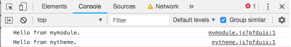

# This the example repo of the my blog post

[USING WEBPACK TO UNLEASH YOUR DRUPAL 8 PROJECT WITH MODERN JAVASCRIPT](https://shinesolutions.com/2018/11/05/using-webpack-to-unleash-your-drupal-8-project-with-modern-javascript/)

## Background

With the release of Drupal 8.4, it is starting to use ES6 in core. However, 
there is not yet a standard practice to write ES6 in custom modules and themes.

The ideal solution is for compiled JS to still stay in the original module or 
theme and make our output JS still be compatible with Drupal 8. Drupal is 
heavily modular, so Javascript files written for a module should ideally be 
stored with it. This atomic design pattern allows a module to easily be enabled 
or uninstalled, and makes our code clean. JS files could be also added in a 
theme level if they are more related to that theme.

In this blog we will share our story on how to configure the project with 
webpack and other tools to facilitate ES6 in the whole Drupal 8 project 
including both custom modules and at the theme level.

Before starting, get the following tools ready on your local machine:

- Composer, install from [https://getcomposer.org/download/](https://getcomposer.org/download/)
- Drush 9 or Drush-launcher: install from [http://docs.drush.org/en/master/install/](http://docs.drush.org/en/master/install/)
- MAMP or similar tool (this is used to set up the Drupal local dev website) install from [https://www.mamp.info/en/downloads/](https://www.mamp.info/en/downloads/)

**Assuming:**

- you have created a virtual host in your MAMP
- your MySQL root user is root and password is root
- you have created a database in MySQL database called drupal-project

## Install example Drupal site
### Preparation
Create a settings.php page by

```bash
cd web/sites/default
cp default.settings.php settings.php
```

Open the `settings.php` file and config the database settings as below

```php
$databases['default']['default'] = array (
 'database' => 'drupal-project',
 'username' => 'root',
 'password' => 'root',
 'prefix' => '',
 'host' => '127.0.0.1',
 'port' => '3306',
 'namespace' => 'Drupal\\Core\\Database\\Driver\\mysql',
 'driver' => 'mysql',
);
```

### Install the Drupal site

```bash
drush site:install
```

### Enable the custom module

```bash
drush pm:enable mymodule –yes
```

### Enable the custom theme and set it as default theme

```bash
drush config:set system.theme default mytheme --yes
```

### Disable JS aggregation for testing

```bash
drush config:set system.performance js.preprocess 0 --yes
```

## Test
### Build JS

```bash
# Switch to the right node version
nvm use
 
# Build JS for the development mode
npm run build:js-dev
 
# Build JS for the production mode
npm run build:js
```

### Check the brower console

Open the Drupal website in Chrome with developer console opened, refresh the page


